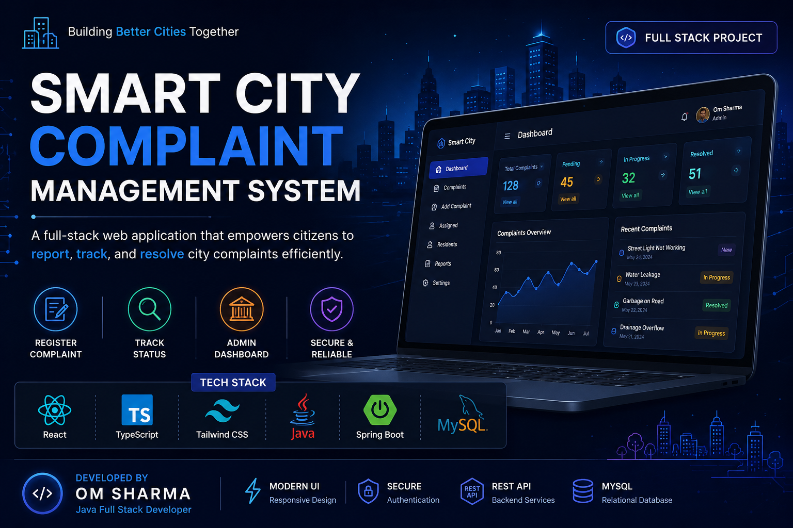
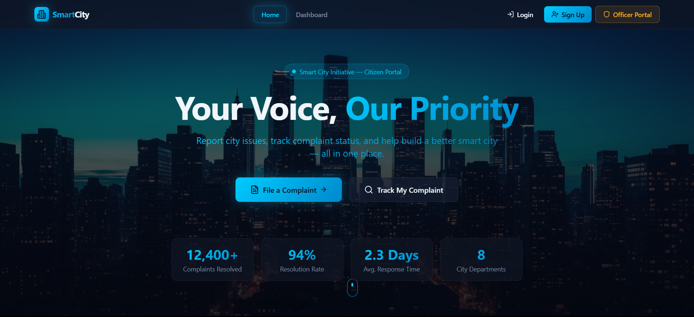
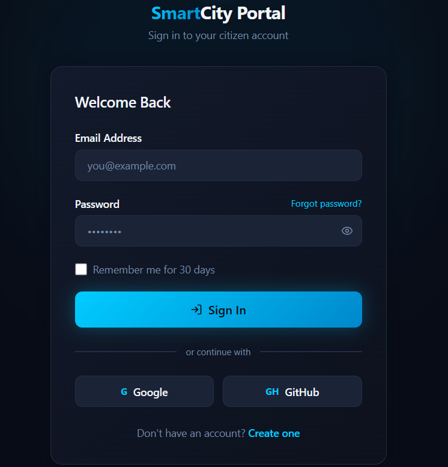
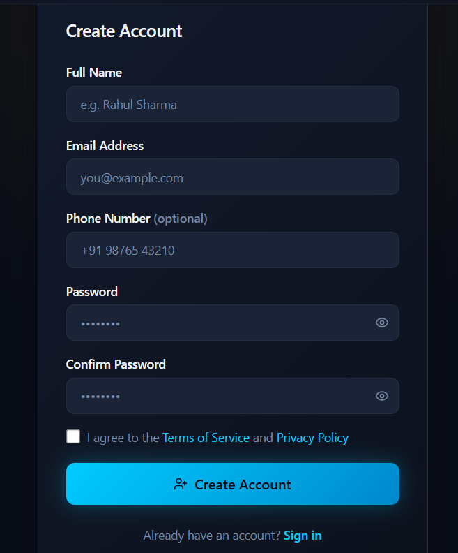
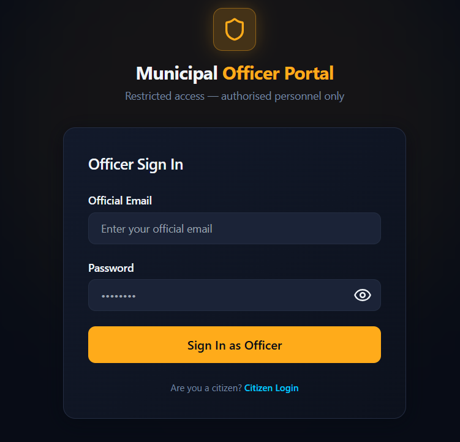
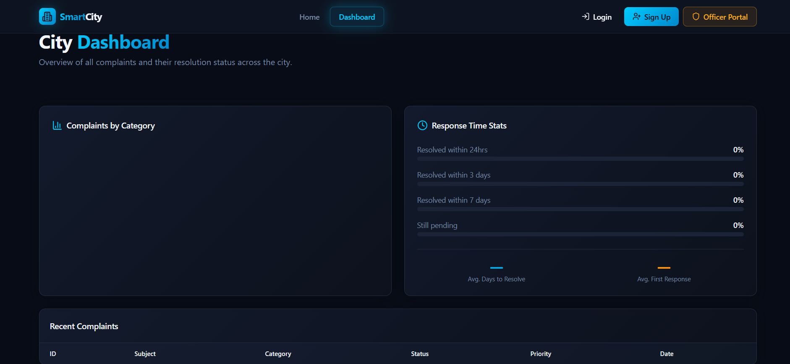

<p align="center">
  
</p>

<p align="center">
  
  
  
  
  
  
</p>
# 🚀 Smart City Complaint Management System

> A modern full-stack web application that enables citizens to report, track, and manage city complaints efficiently.

---

## 📌 Project Overview

The Smart City Complaint Management System is a web-based platform developed to simplify the complaint management process between citizens and city authorities.

Users can register complaints, track complaint status, and receive updates while administrators can monitor, assign and resolve complaints through an admin dashboard.

---

## ✨ Features

- 🔐 User Authentication
- 📝 Register Complaint
- 📍 Track Complaint Status
- 👨‍💼 Admin Dashboard
- 📊 Complaint Management
- ⚡ Responsive UI
- 🔒 Secure Backend APIs

---

## 🛠 Tech Stack

### Frontend
- React
- TypeScript
- Vite
- Tailwind CSS

### Backend
- Java
- Spring Boot
- REST API

### Database
- MySQL

---

## 📂 Project Structure

```text
smart-city-complaint-management-system
│
├── complaint-system
└── smart-city-connect-88
```

---

## 🚀 Getting Started

### Backend

```bash
cd complaint-system
mvn spring-boot:run
```

### Frontend

```bash
cd smart-city-connect-88
npm install
npm run dev
```

---

## 👨‍💻 Author

**Om Sharma**

Java Full Stack Developer

---

⭐ If you like this project, don't forget to Star this repository.
---

# 👨‍💻 Developer

## Om Sharma

Full Stack Java Developer | React Developer | UI/UX Designer

📧 Email: Som758210@gmail.com

🌐 GitHub:
https://github.com/OMsharma200429

💼 LinkedIn:
https://www.linkedin.com/in/om-sharma-a0859833a/

---

⭐ If you found this project useful, don't forget to Star this repository.
## 📸 Project Screenshots

### 🏠 Home Page



---

### 🔐 Login Page



---

### 📝 Signup Page



---

### 👮 Officer Login



---

### 📊 Dashboard


## 🛠️ Tech Stack

### Frontend

- React.js
- TypeScript
- Tailwind CSS
- Vite
- ShadCN UI
- Lucide React

### Backend

- Java 17
- Spring Boot
- Spring Data JPA
- Maven

### Database

- MySQL

### Tools

- Git
- GitHub
- VS Code
- Postman
---

# 🚀 Future Enhancements

- 🔐 JWT Authentication & Authorization
- 📧 Email Notifications
- 📱 Responsive Mobile Design
- 📍 Google Maps Integration
- 📷 Complaint Image Upload
- 🔔 Real-time Complaint Status Updates
- 📊 Advanced Analytics Dashboard
- 📂 Complaint History
- 👮 Municipal Officer Management
- ☁️ Cloud Deployment (Vercel + Render)

---

# 🤝 Contributing

Contributions are welcome!

1. Fork the repository
2. Create a feature branch
3. Commit your changes
4. Push your branch
5. Open a Pull Request

---

# ⭐ Support

If you found this project helpful, please give it a ⭐ on GitHub.

---

# 👨‍💻 Author

**Om Sharma**

💼 Full Stack Java Developer

🔗 LinkedIn: https://www.linkedin.com/in/om-sharma-a0859833a/

📧 Email: *Add your email here*

---

## 📜 License

This project is licensed under the **MIT License**.

Copyright © 2026 Om Sharma. All rights reserved. 
